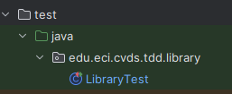

# LABORATORIO 3 - TDD
## Miguel Angel Vanegas Cardenas
## Nicolas Andres Duarte Rodriguez
## DESARROLLO.
Como primer paso creamos el proyecto maven, una vez ya configurado realizamos los respectivos cambios en el pom para incluir la libreria de JUnit para los testeos.
El pom quedo de la siguiente manera.
- 
Ahora copiamos las clases especificadas en el laboratorio:
### AGREGAR CLASES
En el paquete ```edu.eci.cvds.tdd.library.book``` cree la siguiente clase:
```java
package edu.eci.cvds.tdd.library.book;

public class Book {
    private final String tittle;
    private final String author;
    private final String isbn;

    public Book(String tittle, String author, String isbn) {
        this.tittle = tittle;
        this.author = author;
        this.isbn = isbn;
    }

    public String getTittle() {
        return tittle;
    }

    public String getAuthor() {
        return author;
    }

    public String getIsbn() {
        return isbn;
    }

    @Override
    public boolean equals(Object obj) {
        return isbn.equals(((Book)obj).isbn);
    }
}
```
A continuación en el paquete ```edu.eci.cvds.tdd.library.user``` cree la siguiente clase:
```java
package edu.eci.cvds.tdd.library.user;

public class User {
    private String name;
    private String id;

    public String getName() {
        return name;
    }

    public void setName(String name) {
        this.name = name;
    }

    public String getId() {
        return id;
    }

    public void setId(String id) {
        this.id = id;
    }
}
```
En el paquete ```edu.eci.cvds.tdd.library.loan``` se deben crear las clases Loan y el enum LoanStatus:
```java
package edu.eci.cvds.tdd.library.loan;

import edu.eci.cvds.tdd.library.book.Book;
import edu.eci.cvds.tdd.library.user.User;

import java.time.LocalDateTime;

public class Loan {
    private Book book;
    private User user;
    private LocalDateTime loanDate;
    private LoanStatus status;
    private LocalDateTime returnDate;

    public Book getBook() {
        return book;
    }

    public void setBook(Book book) {
        this.book = book;
    }

    public User getUser() {
        return user;
    }

    public void setUser(User user) {
        this.user = user;
    }

    public LocalDateTime getLoanDate() {
        return loanDate;
    }

    public void setLoanDate(LocalDateTime loanDate) {
        this.loanDate = loanDate;
    }

    public LoanStatus getStatus() {
        return status;
    }

    public void setStatus(LoanStatus status) {
        this.status = status;
    }

    public LocalDateTime getReturnDate() {
        return returnDate;
    }

    public void setReturnDate(LocalDateTime returnDate) {
        this.returnDate = returnDate;
    }
}
```
```java
package edu.eci.cvds.tdd.library.loan;

public enum LoanStatus {
    ACTIVE, RETURNED
}
```
por último se debe crear la siguiente clase en el paquete ```edu.eci.cvds.tdd.library```

```java
package edu.eci.cvds.tdd.library;

import edu.eci.cvds.tdd.library.book.Book;
import edu.eci.cvds.tdd.library.loan.Loan;
import edu.eci.cvds.tdd.library.user.User;

import java.util.ArrayList;
import java.util.HashMap;
import java.util.List;
import java.util.Map;

/**
 * Library responsible for manage the loans and the users.
 */
public class Library {

    private final List<User> users;
    private final Map<Book, Integer> books;
    private final List<Loan> loans;

    public Library() {
        users = new ArrayList<>();
        books = new HashMap<>();
        loans = new ArrayList<>();
    }

    /**
     * Adds a new {@link edu.eci.cvds.tdd.library.book.Book} into the system, the book is store in a Map that contains
     * the {@link edu.eci.cvds.tdd.library.book.Book} and the amount of books available, if the book already exist the
     * amount should increase by 1 and if the book is new the amount should be 1, this method returns true if the
     * operation is successful false otherwise.
     *
     * @param book The book to store in the map.
     *
     * @return true if the book was stored false otherwise.
     */
    public boolean addBook(Book book) {
        //TODO Implement the logic to add a new book into the map.
        return false;
    }

    /**
     * This method creates a new loan with for the User identify by the userId and the book identify by the isbn,
     * the loan should be store in the list of loans, to successfully create a loan is required to validate that the
     * book is available, that the user exist and the same user could not have a loan for the same book
     * {@link edu.eci.cvds.tdd.library.loan.LoanStatus#ACTIVE}, once these requirements are meet the amount of books is
     * decreased and the loan should be created with {@link edu.eci.cvds.tdd.library.loan.LoanStatus#ACTIVE} status and
     * the loan date should be the current date.
     *
     * @param userId id of the user.
     * @param isbn book identification.
     *
     * @return The new created loan.
     */
    public Loan loanABook(String userId, String isbn) {
        //TODO Implement the login of loan a book to a user based on the UserId and the isbn.
        return null;
    }

    /**
     * This method return a loan, meaning that the amount of books should be increased by 1, the status of the Loan
     * in the loan list should be {@link edu.eci.cvds.tdd.library.loan.LoanStatus#RETURNED} and the loan return
     * date should be the current date, validate that the loan exist.
     *
     * @param loan loan to return.
     *
     * @return the loan with the RETURNED status.
     */
    public Loan returnLoan(Loan loan) {
        //TODO Implement the login of loan a book to a user based on the UserId and the isbn.
        return null;
    }

    public boolean addUser(User user) {
        return users.add(user);
    }

}
```
## PRUEBAS UNITARIAS.
Para esta parte realizaremos las pruebas unitarias para la clase library, por lo tanto creamos la clase LibraryTest
- 
Vamos a dividir esta parte en features, cada uno de los metodos tendra su propio feature, debido a que somos dos, uno tomara dos features y el otro una,
cabe aclarar que la persona que hizo dos features, una de las dos fue hecha con la metodologia agil, programacion a pares.
### Test
feature/addBook
- 
feature/loanABook
- 
feature/returnloan
- 
### Code
feature/addBook
- 
feature/loanABook
- 
feature/returnloan
- 
#### Todas las pruebas pasan:
- 
## JACOCO
El resultado de la JACOCO.
- 
## 